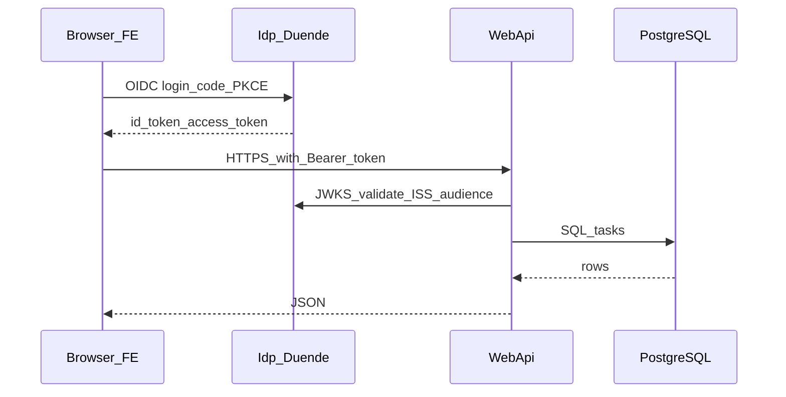

# BLAInterview

Monorepo for a tasks SPA (**React + Vite**), a **.NET 8 Web API** backed by **PostgreSQL**, and a local **Duende IdentityServer** identity provider (IDP) for **OIDC/OAuth2** (Authorization Code + **PKCE**). This document is written for a range of readers: use the **TL;DR** if you only need to run the stack, skim **Architecture & production considerations** if you are reviewing the system.

---

## TL;DR (about five minutes)

1. Install [.NET 8 SDK](https://dotnet.microsoft.com/download), [Node.js](https://nodejs.org/) (LTS), [PostgreSQL](https://www.postgresql.org/download/), and Git.
2. Trust the ASP.NET dev HTTPS certificate: `dotnet dev-certs https --trust` (Windows/macOS).
3. Create a PostgreSQL database and run the schema script [`init-db/001-init.sql`](init-db/001-init.sql).
4. Point the Web API at your database (see [Configure the database](docs/configure-the-database.md)).
5. Open **three terminals** from the repo root and run, **in this order**:
   - **IDP:** `dotnet run --project BE/src/BLAInterview.Idp/BLAInterview.Idp.csproj --launch-profile https`
   - **API:** `dotnet run --project BE/src/BLAInterview.WebApi/BLAInterview.WebApi.csproj --launch-profile https`
   - **FE:** `cd FE && npm install && cp .env.example .env && npm run dev`
6. Open `http://localhost:5173`. Confirm IDP Swagger at `https://localhost:7007/swagger` and API Swagger at `https://localhost:7205/swagger`.

**What “good” looks like:** both Swaggers load without TLS errors, the SPA loads, sign-in completes, and API calls return **200** (not **403**—see [Troubleshooting](#troubleshooting)).

---

## Prerequisites

| Tool | Purpose |
|------|---------|
| **.NET 8 SDK** | Build and run `BLAInterview.Idp` and `BLAInterview.WebApi` |
| **Node.js** (LTS recommended) | Install and run the Vite/React frontend (`FE`) |
| **PostgreSQL** | Persist tasks for the Web API (the sample IDP uses in-memory stores only) |
| **Git** | Clone this repository |

Optional: **Docker** or a local PostgreSQL install—anything that gives you a reachable connection string for the API.

---

## Project structure

High-level map of the repository:

| Path | Role |
|------|------|
| [`BE/BLAInterview.Backend.sln`](BE/BLAInterview.Backend.sln) | .NET 8 solution: IDP, Web API, clean-architecture layers, test projects |
| [`BE/src/BLAInterview.Idp`](BE/src/BLAInterview.Idp) | **IDP** — Duende IdentityServer; EF Core **in-memory** configuration and operational stores; seeds clients and scopes from [`Config.cs`](BE/src/BLAInterview.Idp/Config.cs) |
| [`BE/src/BLAInterview.WebApi`](BE/src/BLAInterview.WebApi) | **Web API** — JWT Bearer; validates tokens using the IDP `Authority`; uses **Npgsql** for tasks |
| [`BE/src/BLAInterview.Application`](BE/src/BLAInterview.Application) / [`Domain`](BE/src/BLAInterview.Domain) / [`Infrastructure`](BE/src/BLAInterview.Infrastructure) | **Clean architecture** — domain and application logic, infrastructure adapters |
| [`FE/`](FE/) | **Frontend** — React 19, Vite 8, OIDC via `react-oidc-context` |
| [`init-db/001-init.sql`](init-db/001-init.sql) | PostgreSQL DDL for the `tasks` table (run once per database) |

The SPA client id and API scope used in dev are defined in code (for example `bla-interview-spa` and `bla-interview-api` in [`BE/src/BLAInterview.Idp/Config.cs`](BE/src/BLAInterview.Idp/Config.cs)).

### How requests flow (development)



---

## Technical requirements by component

### Shared

- **HTTPS in development:** Browsers and tools must trust the development certificate. Run `dotnet dev-certs https --trust` once per machine (and reinstall after certain OS or SDK updates).

### IDP (`BLAInterview.Idp`)

- **No external database** for Duende in this template: configuration and operational stores use **in-memory** EF Core databases (see [`BE/src/BLAInterview.Idp/Program.cs`](BE/src/BLAInterview.Idp/Program.cs)).
- **Default HTTPS URL:** `https://localhost:7007` (see [`BE/src/BLAInterview.Idp/Properties/launchSettings.json`](BE/src/BLAInterview.Idp/Properties/launchSettings.json), profile `https`).
- **Swagger** (Development): `/swagger`.

### Web API (`BLAInterview.WebApi`)

- **PostgreSQL** required. Configure connection string `MainDb` in [`BE/src/BLAInterview.WebApi/appsettings.Development.json`](BE/src/BLAInterview.WebApi/appsettings.Development.json), environment variables, or [User Secrets](https://learn.microsoft.com/en-us/aspnet/core/security/app-secrets) (`dotnet user-secrets`).
- **JWT:** `Authentication:Authority` must match the running IDP origin (e.g. `https://localhost:7007`). Audience defaults to `bla-interview-api` (see [`BE/src/BLAInterview.WebApi/appsettings.json`](BE/src/BLAInterview.WebApi/appsettings.json) and [`Program.cs`](BE/src/BLAInterview.WebApi/Program.cs)).
- **Default HTTPS URL:** `https://localhost:7205` ([`launchSettings.json`](BE/src/BLAInterview.WebApi/Properties/launchSettings.json), profile `https`).
- **Swagger** (Development): `/swagger`.

### Frontend (`FE`)

- Install dependencies: `npm install` in [`FE/`](FE/).
- Copy [`FE/.env.example`](FE/.env.example) to `FE/.env` and adjust if your ports or URLs differ.
- For full stack against this repo’s IDP, typical values include `VITE_OIDC_AUTHORITY=https://localhost:7007`, `VITE_OIDC_CLIENT_ID=bla-interview-spa`, and scopes that include **`bla-interview-api`** (without that scope, the API returns **403**).
- **Dev proxy:** [`FE/vite.config.ts`](FE/vite.config.ts) forwards `/api` to `https://localhost:7205`. With `VITE_API_BASE_URL=/api`, the browser stays same-origin to Vite and avoids CORS issues while developing.

### Configure the database

Full steps (create database, run [`init-db/001-init.sql`](init-db/001-init.sql), set `ConnectionStrings:MainDb` via User Secrets, environment variables, or appsettings, and verify) are in **[docs/configure-the-database.md](docs/configure-the-database.md)**.

---

## Run the project (example commands)

Run from the **repository root** unless noted.

**Startup order matters:** start the **IDP** before the **Web API** so metadata and signing keys are available; start the **FE** last.

### 1. Database

Create the database and apply [`init-db/001-init.sql`](init-db/001-init.sql).

### 2. Identity provider (HTTPS)

```bash
dotnet run --project BE/src/BLAInterview.Idp/BLAInterview.Idp.csproj --launch-profile https
```

### 3. Web API (HTTPS)

```bash
dotnet run --project BE/src/BLAInterview.WebApi/BLAInterview.WebApi.csproj --launch-profile https
```

### 4. Frontend

```bash
cd FE
npm install
cp .env.example .env
npm run dev
```

Default dev server: `http://localhost:5173`.

### Ports (development defaults)

| Service | Base URL |
|---------|----------|
| IDP | `https://localhost:7007` |
| Web API | `https://localhost:7205` |
| Frontend (Vite) | `http://localhost:5173` |

---

## OIDC and API access

- The SPA is registered as a **public** client with **PKCE**; redirect URIs for localhost are listed in [`BE/src/BLAInterview.Idp/Config.cs`](BE/src/BLAInterview.Idp/Config.cs).
- The access token must include the **`bla-interview-api`** scope (space-separated in `VITE_OIDC_SCOPE` in `.env`). Authorization in [`BE/src/BLAInterview.WebApi/Program.cs`](BE/src/BLAInterview.WebApi/Program.cs) requires that scope; otherwise expect **403 Forbidden**.
- **Registration:** For hosted sign-up, point `VITE_OIDC_REGISTRATION_URL` at your IDP’s registration route if applicable (see [`FE/.env.example`](FE/.env.example)). Update production URLs to match your deployment.

---

## UI-only development (no IDP or API)

Set `VITE_MOCK_API=true` in `FE/.env` and follow [FE/README.md](FE/README.md) for details on env vars and API contracts.

---

## Troubleshooting

| Symptom | Likely cause | What to try |
|---------|----------------|------------|
| Browser warns about **unsafe HTTPS** on `localhost:7007` / `7205` | Dev cert not trusted | `dotnet dev-certs https --trust`; restart browser |
| **403** from API after login | Access token missing **`bla-interview-api`** scope | Fix `VITE_OIDC_SCOPE` in `FE/.env`; sign out and sign in again |
| API fails at startup | Bad or missing `MainDb` connection string | Verify PostgreSQL is running; database exists; schema applied; secrets correct |
| FE cannot reach API | Wrong `VITE_API_BASE_URL` or API not running | Use `/api` with Vite proxy and ensure Web API is on `https://localhost:7205` |
| **Authority** mismatch | IDP URL changed | Align `Authentication:Authority` in Web API and `VITE_OIDC_AUTHORITY` in the SPA |

---

## Tests

Test projects live under [`BE/tests`](BE/tests). Some suites use PostgreSQL or Testcontainers. From `BE/`:

```bash
dotnet test
```

---

## Architecture & production considerations

For **senior engineers and architects** skimming this section:

- **Boundaries:** The Web API follows **clean architecture**: [`Domain`](BE/src/BLAInterview.Domain) has no framework dependencies; [`Application`](BE/src/BLAInterview.Application) orchestrates use cases; [`Infrastructure`](BE/src/BLAInterview.Infrastructure) implements persistence (e.g. [`TaskRepository`](BE/src/BLAInterview.Infrastructure/Tasks/TaskRepository.cs)); [`BLAInterview.WebApi`](BE/src/BLAInterview.WebApi) is the composition root and HTTP surface.
- **IDP in this repo** is a **development-oriented** Duende host: in-memory stores and developer signing credentials are **not** a production topology. For production, plan persisted configuration, key management, hardened hosting, and a supported IdentityServer / cloud IdP strategy.
- **Security:** The SPA never stores a client secret; use **PKCE**. Keep database and IdP secrets out of source control (User Secrets, vaults, managed identity where applicable). The sample Web API registers a permissive **CORS** policy (`AllowAll`) in [`Program.cs`](BE/src/BLAInterview.WebApi/Program.cs)—tighten origins in production.
- **Extension points:** New features typically add application handlers and infrastructure adapters, then expose controllers in the Web API. Replacing this IDP with Entra ID, Auth0, or Keycloak implies updating `Authentication:Authority`, client registration, and FE `VITE_OIDC_*` values consistently.
- **Database:** Schema changes today are represented by SQL under [`init-db`](init-db); a production pipeline would add migration discipline (owned scripts or tooling) as the model evolves.

---

## Further reading

- **[docs/configure-the-database.md](docs/configure-the-database.md)** — PostgreSQL setup, schema script, connection strings, and troubleshooting for the Web API.
- **[FE/README.md](FE/README.md)** — Environment variables table, Vite proxy vs production CORS, task API contract, and folder layout for the SPA.
